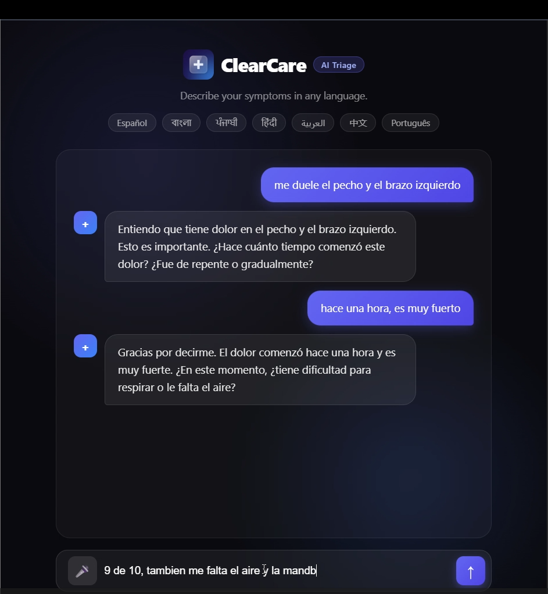
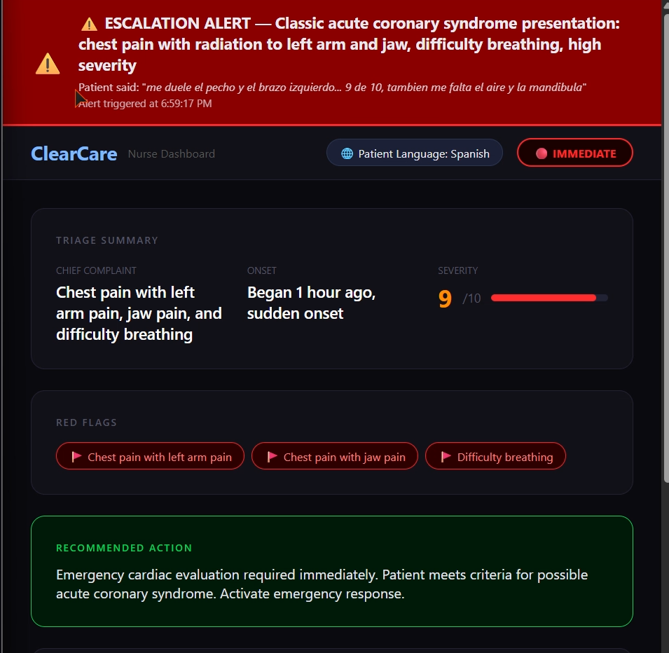

# ClearCare 🏥
### AI-Powered Multilingual Triage Assistant

> Bridging the language barrier in emergency care one patient at a time.

---

## The Problem

37 million Americans have limited English proficiency. In Newark, NJ ERs one of America's most linguistically diverse cities — patients who don't speak English wait hours for human interpreters. Nurses make triage decisions on incomplete information. Language barriers cause documented worse outcomes and higher mortality rates.

## The Solution

ClearCare is a Claude-powered multilingual triage assistant. Patients describe their symptoms in any language. Claude interviews them, collects clinical information, and delivers a clean English summary to the nurse — in real time.

---

## Screenshots

### Patient Side


### Nurse Dashboard


---

## How It Works

1. Patient opens ClearCare on a tablet and types in their native language
2. Claude auto-detects the language and conducts a structured triage interview
3. Claude collects: chief complaint, onset, severity (1-10), location, medical history
4. If life-threatening symptoms are detected, an escalation alert fires on the nurse dashboard immediately
5. When the interview is complete, Claude generates a structured English summary
6. The nurse sees: triage priority, red flags, recommended action, and full transcript
7. The nurse makes every clinical decision, ClearCare just ensures she has the full picture

---

## Features

- Multilingual conversation in any language (Spanish, Bengali, Hindi, Punjabi, Arabic, Mandarin and more)
- Voice input via Deepgram API
- Real-time escalation detection for life-threatening symptoms
- Nurse dashboard with triage priority badge (Immediate / Urgent / Non-Urgent)
- Red flag chips and severity bar
- Full patient transcript in original language
- Session-only data nothing persisted

---

## Tech Stack

| Layer | Technology |
|---|---|
| Patient UI | React + Vite |
| Voice Input | Deepgram API |
| AI | Claude Haiku (Anthropic) |
| Backend | Node.js + Express |
| Nurse Dashboard | React (CRA) |
| Real-time | Polling every 2 seconds |

---

## Architecture
Patient (localhost:5173)
→ Express Server (localhost:4000)
→ Claude Haiku API
→ Deepgram API (voice)
→ POST /api/summary
→ POST /api/escalation
→ Nurse Dashboard (localhost:3000)
→ GET /api/summary/latest (polls every 2s)

---

## Running Locally

### Prerequisites
- Node.js 18+
- Anthropic API key
- Deepgram API key

### Setup

```bash
git clone https://github.com/ReyanshBhootra/clearcare.git
cd clearcare
```

**Server:**
```bash
cd server
npm install
```

Create `server/.env`:
ANTHROPIC_KEY=your_key_here
DEEPGRAM_KEY=your_key_here

```bash
node index.js
```

**Patient UI:**
```bash
cd client
npx vite
```

Visit `http://localhost:5173`

**Nurse Dashboard:**
```bash
cd client
npm start
```

Visit `http://localhost:3000`

---

## Ethical Considerations

- Claude never diagnoses — nurses make all clinical decisions
- All data is session-only, nothing persisted
- Escalation alerts exist for life-threatening edge cases
- Language accuracy validation required before real deployment
- Phase 1 deployment target: community health clinics and urgent care, not hospital ERs

---

## Built At

NJIT Claude Builder Club Hackathon — April 26, 2026
Track: Health & Wellbeing

**Team:** Reyansh Bhootra + Shippy Singh

---

## What's Next

- Bilingual clinical reviewer validation for each language
- Partnership with Newark FQHCs (Federally Qualified Health Centers)
- HIPAA-compliant infrastructure for production deployment
- Voice-first interface for elderly and low-literacy patients

---
